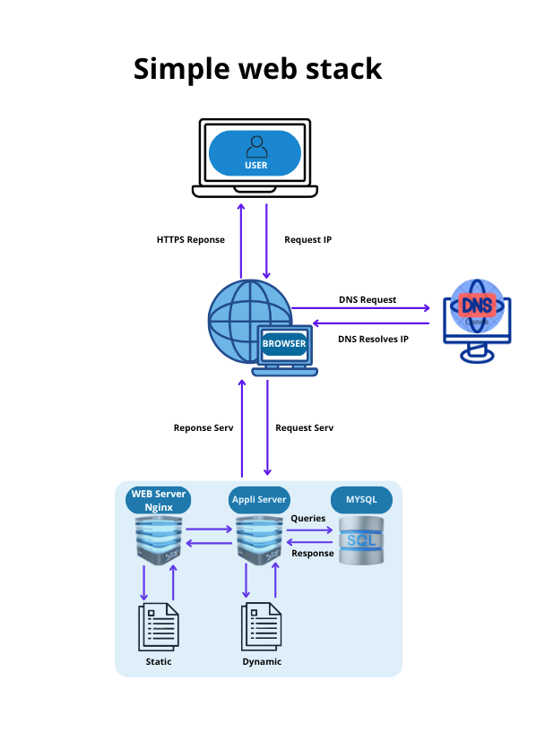

## **Explanation of Components**

- **What is a server ?**   
A server is a computer, virtual machine, or software that provides services to other
devices called clients. It can host a website, store data, handle network requests, and much more.

- **What is the role of the domain name ?**  
The domain name (foobar.com) allows users to access a website via an easy-to-remember address rather
than a numeric IP address. It therefore serves as a link between users and the server.

- **What type of DNS record is present in www.foobar.com ?**   
The www record for www.foobar.com is an A record, which associates the domain name with an IP address
(in this case, 8.8.8.8). This record allows browsers to send requests to the correct server.

- **What is the role of the web server ?**  
The web server (NGinx) receives HTTP requests from users, serves static files (HTML, CSS, images),
and forwards dynamic requests to the application server.

- **What is the role of the application server ?**   
The application server executes the website's business logic, processes dynamic requests, and interacts
with the database to retrieve or store information.

- **What is the role of the database ?**   
The database (MySQL) stores and organizes the website's information. It allows the application server
to access user data, articles, products, etc.

- **Which server is used to communicate with the user's computer viewing the website ?**   
The web server (NGinx) communicates with the user's computer via HTTP or HTTPS, allowing the transfer
of website pages and files.

## **Issues with This Infrastructure**

- **SPOF (Single Point of Failure)**  
The infrastructure relies on a single server, which means that in the event of a failure, the entire site becomes inaccessible. There is no backup system to ensure service continuity.

- **Downtime during maintenance**  
 When a code or server update is required, the site must be restarted, resulting in a temporary interruption of service for users.

- **Scalability issues**  
 If traffic becomes too high, the single server risks being overloaded, causing slowdowns or outages. There is no mechanism to distribute the load across multiple machines.