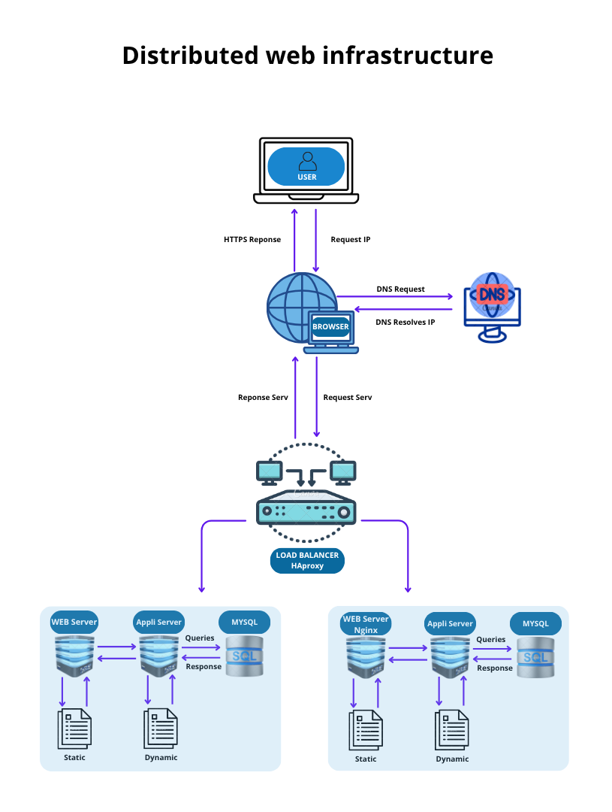

## **Explanation of Additional Elements**
  
**Why add 2 servers ?**  
- `Better load distribution` thanks to a load balancer that prevents overloading a single server.

- `High availability`: If one server fails, another takes over, ensuring continuous service.

- `Scalability`: Allows you to manage more users without performance degradation.

- `Resource optimization`: One server can manage static content (NGinx), the other the application logic.

**Why add a load balancer (HAproxy) ?**
- Load Balancer (HAProxy) → Distributes traffic to prevent a single server from being overloaded.

**What distribution algorithm is the load balancer configured with ?** 

Load Balancer Configuration

- Algorithm Used: Round Robin

Each request is sent to a server in turn, distributing the load evenly.

This choice is simple and effective for environments where each server has equal capacity.

### **Alternatives:**

Least Connections → Sends requests to the least busy servers.

Weighted Round Robin → Takes the power of each server into account to adjust the distribution.

**Is the load balancer enabling an Active-Active or Active-Passive setup ?**   

`Active-Active vs. Active-Passive`

- `Active-Active`:   
    - Both servers operate simultaneously, distributing the load and improving fault tolerance. If one server fails, the other continues to process requests without interruption.

- `Active-Passive`: 
    - Only one server is active; the other remains on standby and takes over only in the event of a failure. 

**In summary**  
*`Active-Active is optimal for performance, while Active-Passive is better suited for controlled high availability.`*

**How a Primary-Replica (Master-Slave) Database Cluster Works**

- The Primary (Master) handles all writes (INSERT, UPDATE, DELETE).
  
- The Replica (Slave) is synchronized with the Primary and handles read queries (SELECT).

**Difference for the Application** 

- The application only writes to the Primary to avoid conflicts.

- Reads can be distributed among multiple replicas, improving performance.

- In the event of a Primary failure, a Replica can be promoted to Primary, reducing downtime.

### **Problems in this Infrastructure**

SPOF (Single Point of Failure)

- If the Load Balancer fails, no server is accessible.
  
- If the Primary Database crashes, the application can no longer write data.

**Security Issues**

- No firewall, exposing servers to attacks.
  
- No HTTPS configuration, making data transmission vulnerable to interception.

**No monitoring**

- No logging or alerting system to quickly detect performance or security issues.

**Possible Improvements**
 
- Redundant Load Balancers to avoid critical SPOF.

- TLS/SSL encryption to secure communications.

- Monitoring tools to track system status.