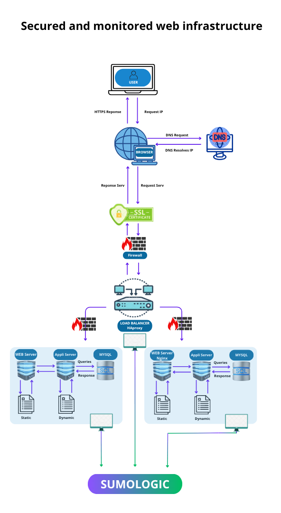

### **Explanation of Additional Elements**

**Why add firewalls?**
Firewalls allow you to:

- Restrict unauthorized access to servers.
- Filter inbound and outbound traffic according to security rules.
- Protect against attacks such as DDoS, brute force, and intrusions.

**Why serve traffic over HTTPS?**  
HTTPS encrypts data exchanged between the user and the server, guaranteeing:

- **Confidentiality**: 
  - Data cannot be intercepted or read by attackers.
- **Integrity**: 
  - Information cannot be altered during transmission.
- **Authentication**: 
  - Users can verify the identity of the server.

**Why add monitoring clients?**  
Monitoring agents collect data to:

- Track server performance (CPU, memory, disk usage).
- Detect and resolve issues such as traffic spikes or outages.
- Provide analytics to optimize and scale infrastructure.

**How ​​does the monitoring tool collect data?**
Monitoring agents (e.g., Sumologic) collect server metrics and send them to a centralized service. This data is then displayed on dashboards for analysis.

**How ​​do I monitor a web server's QPS (Queries Per Second)?**

- Use monitoring tools to track the number of queries processed per second.
- Set up alerts in case of abnormal variations in QPS.
- Analyze trends to optimize server performance and scalability.

### **Issues in this infrastructure**

**Terminate SSL at the Load Balancer**

- **Issue**: 
  - If SSL is stopped at the load balancer, traffic between it and the web servers is unencrypted, increasing the risk of attacks.
- **Solution**:
  - Enable end-to-end encryption by configuring SSL on the web servers.

**Only one MySQL server accepts writes**

- **Issue**:
  - The Primary node is a single point of failure. If it fails, no writes can be performed until a new Primary node is designated.
- **Solution**:
  - Implement a multi-primary cluster or a distributed database to avoid this deadlock.

**All servers have the same components**

- **Problem**: 
  - If each server runs the database, the web server, and the application, a failure of a single service can affect the entire server.
- **Solution**: 
  - Separate the components