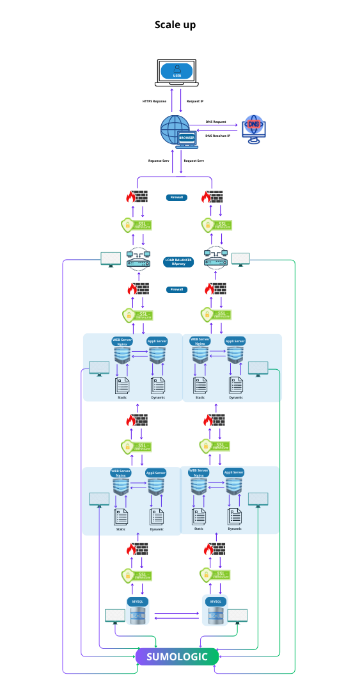

### **Explanation of Additional Elements**

**Standard Web Infrastructure** In a typical web infrastructure, **web servers** and **application servers** have distinct roles:

- **Web Server**:
  -  Handles HTTP requests, serves static content (HTML, CSS, JS), and forwards dynamic requests to the application server (examples: **Nginx**, **Apache**).
- **Application Server**: 
  - Executes business logic, processes dynamic content, and interacts with the database (examples: **Node.js**, **Tomcat**, **Django**).

### **Infrastructure Configuration**

To build a scalable and resilient infrastructure, the following components are required:

**Server**

- Acts as a web server, handling HTTP/HTTPS requests. - Serves static files and redirects dynamic requests to the application server.

**Load Balancer (HAProxy)**

- Distributes traffic between multiple servers to ensure high availability and scalability.
- Configured as a cluster with a second load balancer to ensure redundancy.

**Component Separation**

- **Web Server**: 
  - Dedicated to HTTP/HTTPS requests and static file management.
- **Application Server**: 
  - Processes business logic and generates dynamic content.
- **Database**: 
  - Manages data storage and management.

### **Explanation of Architectural Choices**

**Why add a Load Balancer (HAProxy)?**

- **Objective**:  
  - Distribute traffic evenly to avoid overloading a single server. - Benefits: Improves availability, scalability, and fault tolerance.
- **Cluster Configuration**:   
  - If one load balancer fails, another takes over.

**Why separate the components (web server, application server, database)?**

- **Web Server**:  
  - Exclusively handles HTTP/HTTPS requests and static content. This separation optimizes resource utilization.
- **Application Server**:   
  - Executes business logic and generates dynamic content, improving performance and scalability.
- **Database**:  
  - Dedicated to data storage and management to ensure information integrity and security.